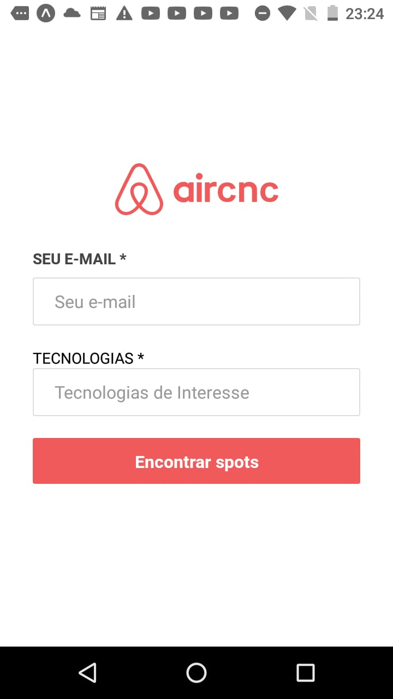
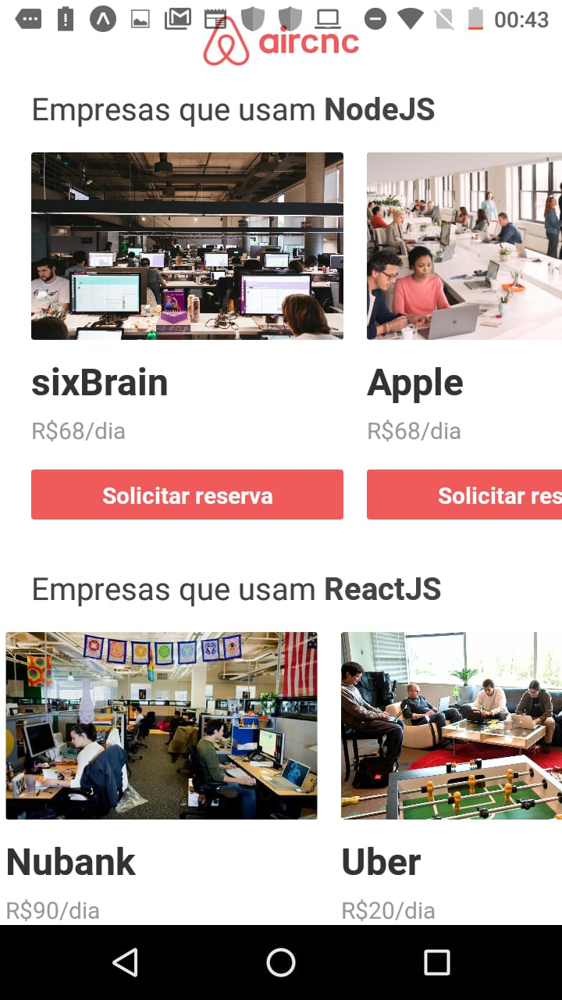
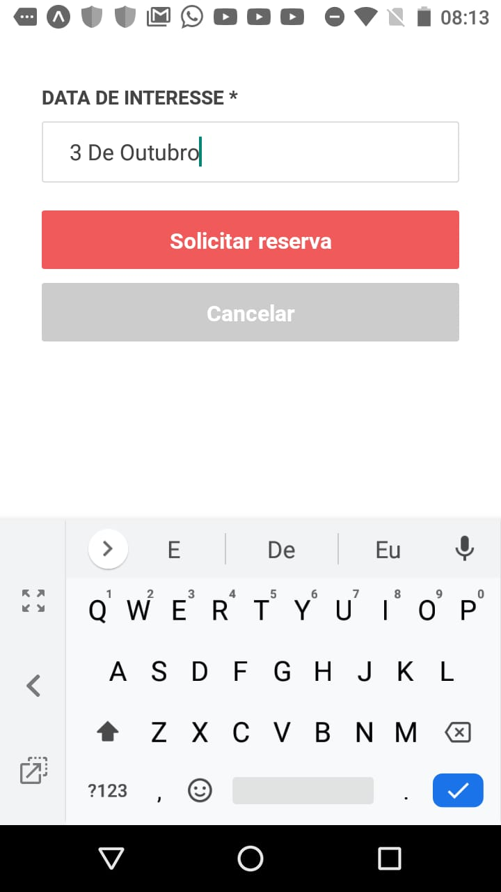
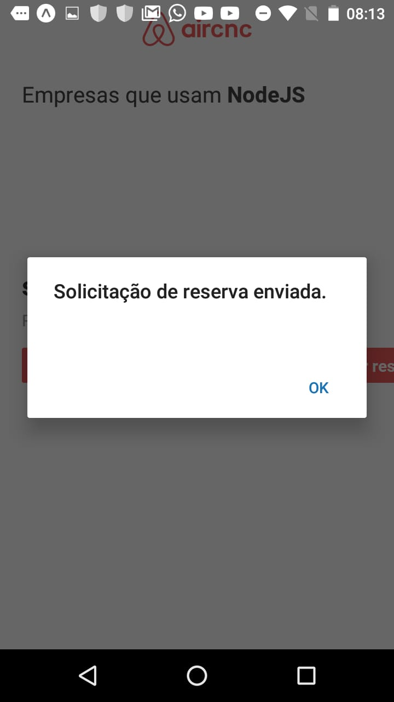
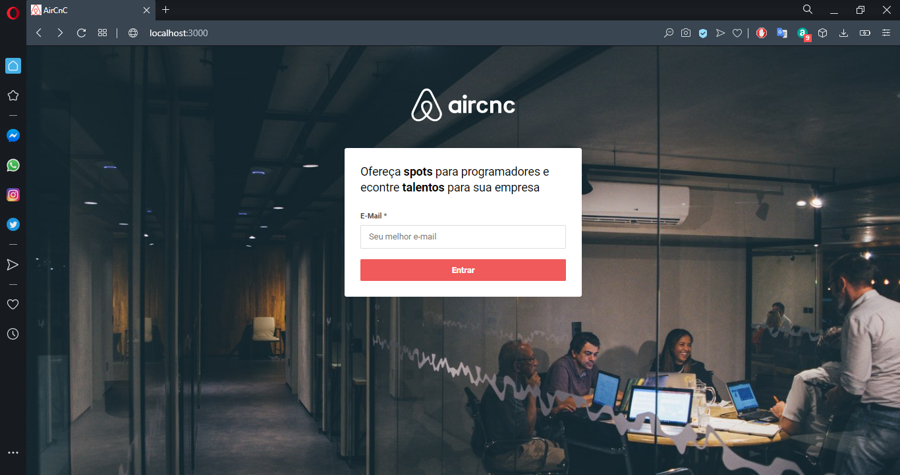
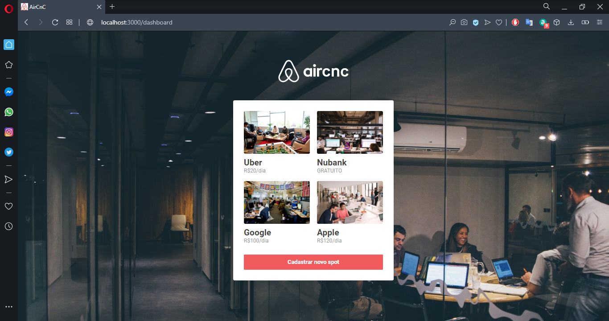
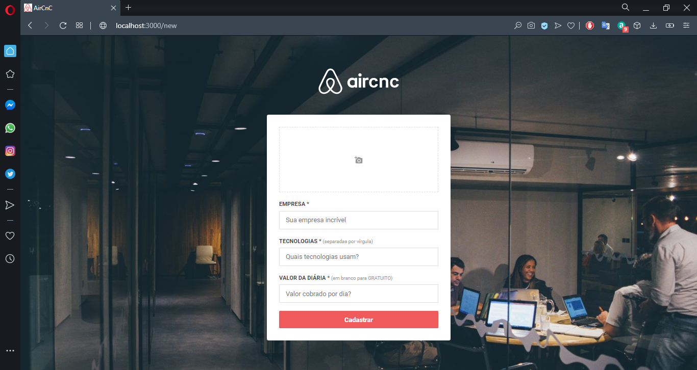
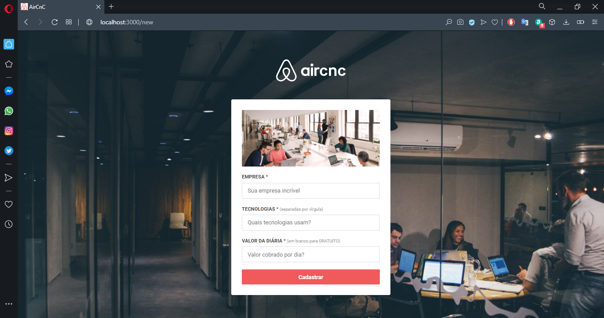

<h1 align="center" style="display: flex; align-items: flex-start; justify-content: center;">
  
</h1>


<h4 align="center"> 
	🚧  AirCnC 1.0 :memo: Concluído 🚀 🚧
</h4>

<br>

## 💻 Sobre o projeto


🚀   **AirCnC** - é um sistema de locação de spots (locais) para devs, permitindo interação em tempo real (Web Socket) entre proprietário (web) e cliente (mobile). 

Projeto desenvolvido durante a **9º Semana Omnistack** oferecida pela [Rocketseat](https://rocketseat.com.br/).

<br>

## ⚙️ Funcionalidades

- [x] As empresas interessadas podem cadastrar seus spots na plataforma web enviando:
  - [x] Nome da Empresa
  - [x] Tecnologias que a empresa opera
  - [x] Valor da diária
  - [x] Avatar/Imagem
  
  <br>
  
- [x] Os usuários interessados podem:
  - [x] Entrar com seu email e tecnologias interessadas.
  - [x] Solicitar reserva


<br>

## 🎨 Layout

### Mobile

<p align="center">
  
  
  
  
</p>

<br>

### Web

<p align="center" style="display: flex; align-items: flex-start; justify-content: center;">
  
  
  
  
</p>

<br>


## :rocket: Tecnologias
### Node.js
<ul>
  <li>Nodemon</li>
  <li>MongoDB</li>
  <li>Mongoose</li>
  <li>Express</li>
  <li>Multer</li>
  <li>Routes</li>
  <li>Path</li>
  <li>Cors</li>
  <li>socket.io WebSocket</li>
</ul>

<br>

### ReactJS
<ul>
  <li>Components</li>
  <li>Routes</li>
  <li>react-router-dom</li>
  <li>Services API</li>
  <li>Axios</li>
  <li>History</li>
  <li>LocalStorage</li>
  <li>useState</li>
  <li>useEffect</li>
  <li>useMemo</li>
  <li>socket.io-client WebSocket</li>
  <li>CSS</li>
  <li>Fonts</li>
</ul>

<br>

### React Native
<ul>
  <li>Expo</li>
  <li>Components</li>
  <li>Routes</li>
  <li>react-navigation</li>
  <li>Services API</li>
  <li>Axios</li>
  <li>AsyncStorage</li>
  <li>useState</li>
  <li>useEffect</li>
  <li>FlatList</li>
  <li>socket.io-client WebSocket</li>
  <li>Alert</li>
</ul>


<br>


## 🚀 Como executar o projeto

Este projeto é divido em três partes:
1. Backend 
2. Frontend 
3. Mobile 

💡 Tanto o Frontend quanto o Mobile precisam que o Backend esteja sendo executado para funcionar.

<br>


### Pré-requisitos

Antes de começar, você vai precisar ter instalado em sua máquina as seguintes ferramentas:
[Git](https://git-scm.com), [Node.js](https://nodejs.org/en/) e o gerenciador de pacotes [Yarn](https://yarnpkg.com).
Além disto é bom ter um editor para trabalhar com o código como [VSCode](https://code.visualstudio.com/)


<br>


#### 🎲 Rodando o Backend (servidor)

```bash

# Clone este repositório
$ git clone https://github.com/savio-2-lopes/AirCnC.git

# Acesse a pasta do projeto no terminal/cmd
$ cd Be-The-Hero

# Vá para a pasta backend
$ cd backend

# Instale as dependências
$ yarn add

# Execute a aplicação em modo de desenvolvimento
$ yarn start

# O servidor inciará na porta:3333 - acesse http://localhost:3333 

```

<br>

#### 🧭 Rodando a aplicação web (Frontend)

```bash

# Clone este repositório
$ git clone https://github.com/savio-2-lopes/AirCnC.git

# Acesse a pasta do projeto no terminal/cmd
$ cd Be-The-Hero

# Vá para a pasta da aplicação Front End
$ cd frontend

# Instale as dependências
$ yarn add

# Execute a aplicação em modo de desenvolvimento
$ yarn start

# A aplicação será aberta na porta:3000 - acesse http://localhost:3000

```

<br>


## 🦸 Autor

<a href="https://github.com/savio-2-lopes">
 
 <br>
 <sub><b>    Savio Lopes </b></sub></a> <a href="https://github.com/savio-2-lopes" title="Github">  🚀</a>
 <br>
 
 
[](https://www.linkedin.com/in/savio-lopes/) 
[](https://github.com/savio-2-lopes)
[](https://api.whatsapp.com/send?phone=12996798894&text=Hello!)
[](mailto:savioaugulopes@gmail.com)


Feito com ❤️ por Savio Lopes 👋🏽 [Entre em contato!](https://www.linkedin.com/in/savio-lopes/)
